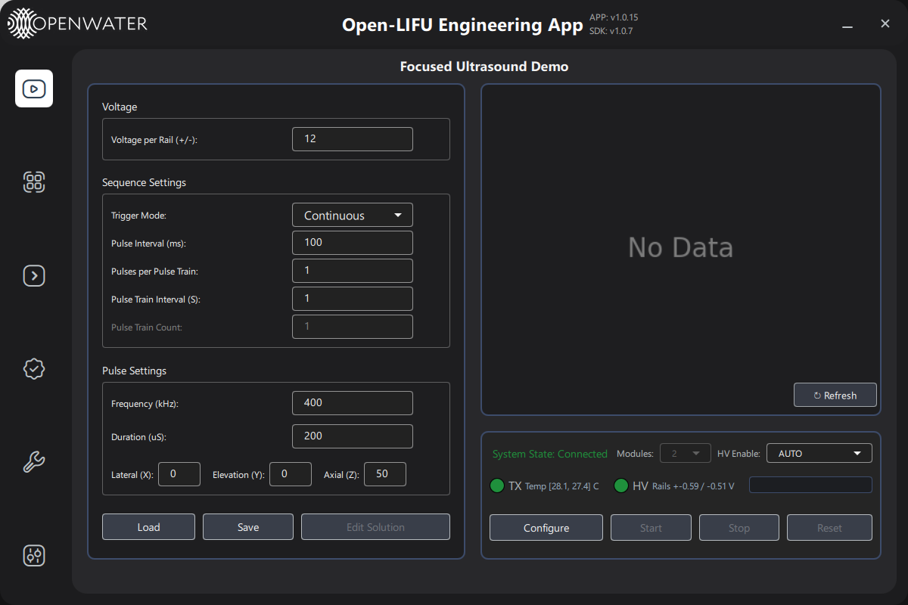

# OpenLIFU Test Application

Python/QML engineering UI for OpenLIFU hardware testing, bring-up, and basic sonication workflows.



## What This App Is For

OpenLIFU Test App is an engineering-first interface with dedicated pages for:

- Full sonication setup and execution (`Controller`)
- Low-level console and transmitter bring-up (`Console`, `Transmitter`)
- Automated verification scripts (`Verification`)
- Device config and firmware updates (`Settings`)
- Fast diagnostics and PDF reporting (`Support`)

## Quick Start

### Prerequisites

- Python 3.10+
- Local checkout of `openlifu-sdk` and `OpenLIFU-python` (or installed package equivalents)

### Install
#### Windows Executable
From the [Releases](https://github.com/OpenwaterHealth/openlifu-test-app/releases) page, download the latest `OpenLifu-TestApp*.zip` asset, extract it, and run `TestApp.exe` or `TestApp_console.exe` (to view console output).

#### Python
1. Clone this repository.

   ```bash
   git clone https://github.com/OpenwaterHealth/OpenLIFU-TestAPP.git
   cd OpenLIFU-TestAPP
   ```

2. Create and activate a virtual environment.

   ```bash
   python -m venv .venv

   # Windows
   .venv\Scripts\activate

   # macOS/Linux
   source .venv/bin/activate
   ```

3. Install dependencies.

   ```bash
   pip install -e .

   # Optional extras
   pip install -e .[dev]
   pip install -e .[test]
   pip install -e .[dev,test]
   ```

4. Install OpenLIFU Python.

   ```bash
   git clone https://github.com/OpenwaterHealth/OpenLIFU-python.git
   cd OpenLIFU-python
   pip install -e .
   cd ..
   ```

5. Launch the app.

   ```bash
   python main.py
   ```

## Documentation Index
| Guide | When to use it |
|-------|----------------|
| [Launch Options](docs/launch-options.md) | Start the app in real, simulated, or HV test mode |
| [Controller Page Guide](docs/controller-page-user-guide.md) | Build/load a sonication solution, configure, run, monitor progress |
| [Transmitter Page Guide](docs/transmitter-page-user-guide.md) | Run per-module TX bring-up tests and trigger/TX quick configs |
| [Console Page Guide](docs/console-page-user-guide.md) | Exercise HV controller communication, rails, LEDs, and monitor channels |
| [Verification Page Guide](docs/testing-page-user-guide.md) | Run long-form PRD verification scripts and inspect run logs |
| [Settings Page Guide](docs/settings-page-user-guide.md) | Read/write user config JSON and update firmware on Console/TX |
| [Support Page Guide](docs/support-page-user-guide.md) | Run rapid diagnostics and export pass/fail PDF reports |

## Build Executable

### Quick Build (Windows)

```cmd
build.bat
```

### Manual Build

1. Install development dependencies.

   ```bash
   pip install -e .[dev]
   ```

2. Run the build script.

   ```bash
   python -m PyInstaller OpenLIFU-TestApp.spec
   ```

3. Find the packaged app.

- Folder: `dist/TestApp/`
- Launcher: `dist/TestApp/TestApp.exe`

The build step cleans previous outputs, packages QML/assets, and generates a one-folder Windows distribution.