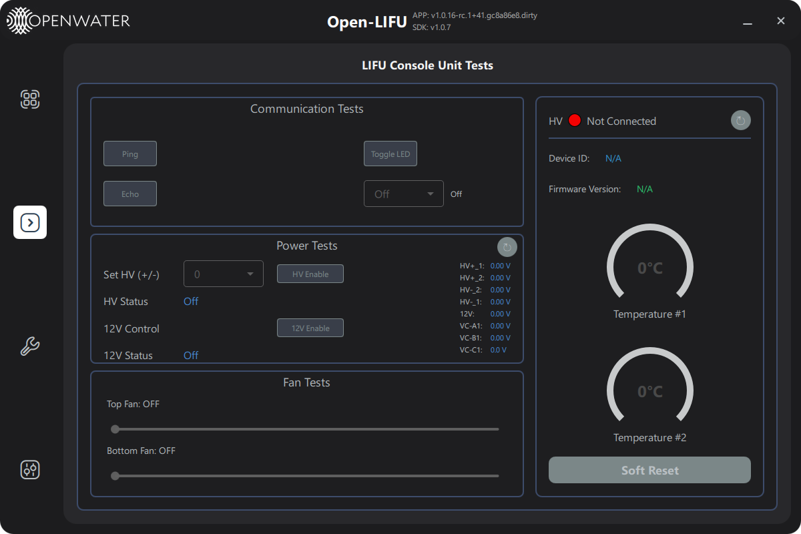

# Console Page — User Guide

**Open-LIFU Test App**

---

## Overview

The **Console** page is a low-level unit-test surface for the HV
Controller (a.k.a. Console) board. It exercises individual firmware
commands one at a time so you can verify connectivity, power rails, and
indicator hardware without running a full sonication.

> **Note:** The Console page is for engineering bring-up. Routine
> hardware health checks should use the [Support](support-page-user-guide.md)
> page's Diagnostics tab instead — it runs the same checks and produces
> a PDF report.

Navigate to the Console page by clicking the console icon in the left
sidebar. The page is hidden in `--simulate` and `--context=<name>` modes.

---

## Page layout

The page is split into a left column of test groups and a right column
showing device info and live temperatures.

| Region | Purpose |
|--------|---------|
| **Left — Communication Tests** | Ping, Echo, Toggle LED, RGB LED |
| **Left — Power Tests** | HV setpoint + enable, 12 V enable, monitored rail readings |
| **Right** | HV connection LED, Device ID, Firmware Version, two on-board temperature widgets |

---

## Communication Tests

| Control | Behaviour |
|---------|-----------|
| **Ping** | Send a `PING` command. Result text shows `Ping SUCCESS` / `Ping FAILED` |
| **Echo** | Send an `ECHO` round-trip and verify the payload comes back intact |
| **Toggle LED** | Toggle the on-board status LED |
| **RGB LED** dropdown | Set the front-panel RGB indicator: `Off`, `Red`, `Green`, `Blue`. The current state is read back from the device on connect |

All four controls are disabled until the HV controller is connected.

---

## Power Tests

### HV rail control

| Control | Behaviour |
|---------|-----------|
| **Set HV (+/-)** dropdown | Choose a setpoint from `0` to `70` V in 5 V steps. Selecting `0` while HV is on simply turns it off |
| **HV Enable** | Toggle the high-voltage rail on/off at the currently chosen setpoint |
| **HV Status** | Live read-back: `On` / `Off` |

> **Warning:** The Console page bypasses the Controller's solution-based
> safety checks. Anything you type here goes straight to the firmware.
> Do not energise HV without verifying the load is connected.

### 12 V rail control

| Control | Behaviour |
|---------|-----------|
| **12V Enable** | Toggle the 12 V system rail |
| **12V Status** | Live read-back: `On` / `Off` |

### Monitored voltages

The right side of the Power Tests box shows the live readings from the
on-board voltage monitor:

| Channel | Description |
|---------|-------------|
| **HV+_1 / HV+_2** | Positive HV rails 1 and 2 |
| **HV-_1 / HV-_2** | Negative HV rails 1 and 2 |
| **12V** | 12 V system rail |
| **VC-A1 / VC-B1 / VC-C1** | Control voltages |

Click the **↻** button at the top-right of the Power Tests box to
re-poll all eight channels immediately.

---

## Right column — Device info & temperatures

| Field | Description |
|-------|-------------|
| **HV** indicator | Green = connected, Red = not connected |
| **Device ID** | Unique hardware identifier reported by the firmware |
| **Firmware Version** | Reported by the firmware over USB |
| **Temperature #1 / #2** | Live readings from the two on-board temperature sensors, °C |

Click the **↻** button to re-query device info and temperatures
manually. Otherwise the values are fetched once on connect (after a
~500 ms settle delay) and on every refresh.

---

## Connection behaviour

- On HV controller connect, the page waits ~500 ms then queries device
  info, temperatures, power status, and RGB state.
- On disconnect, every field resets to default (`N/A`, `0.0`, `Off`).

---

## Troubleshooting

| Symptom | Likely cause | Action |
|---------|--------------|--------|
| All buttons greyed out | HV controller not connected | Plug in the Console; check the LED at top-right turns green |
| `Ping FAILED` | USB stall or firmware hang | Power-cycle the Console |
| Voltage readings stuck at `0.00 V` | HV not enabled, or page hasn't refreshed | Click the refresh button next to Power Tests |
| RGB dropdown does nothing | Old firmware that pre-dates the RGB API | Update the Console firmware from the [Settings](settings-page-user-guide.md) page |
