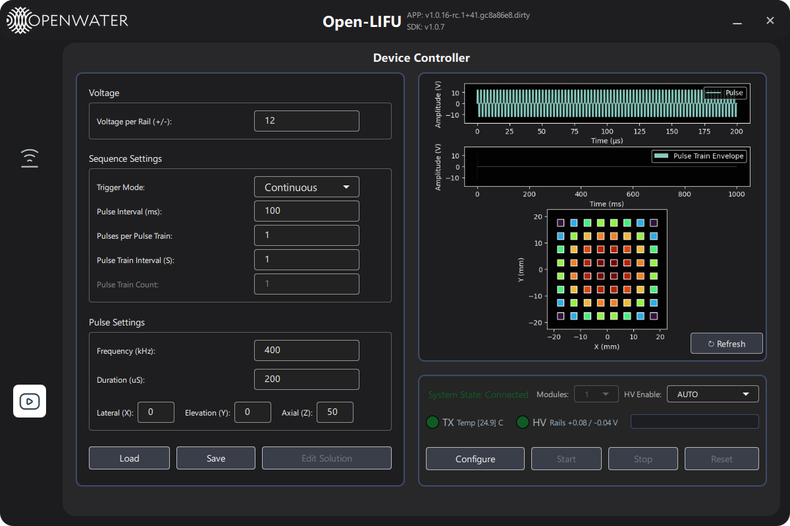
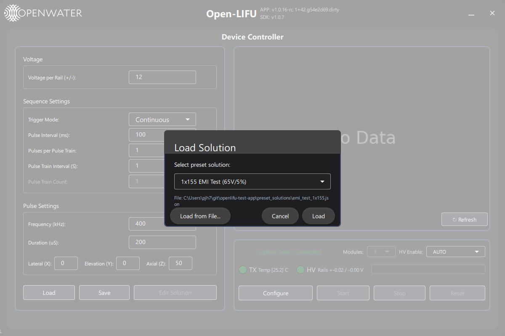
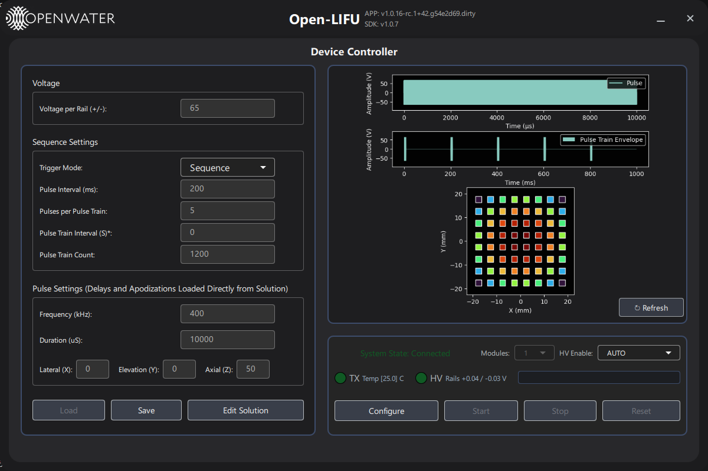
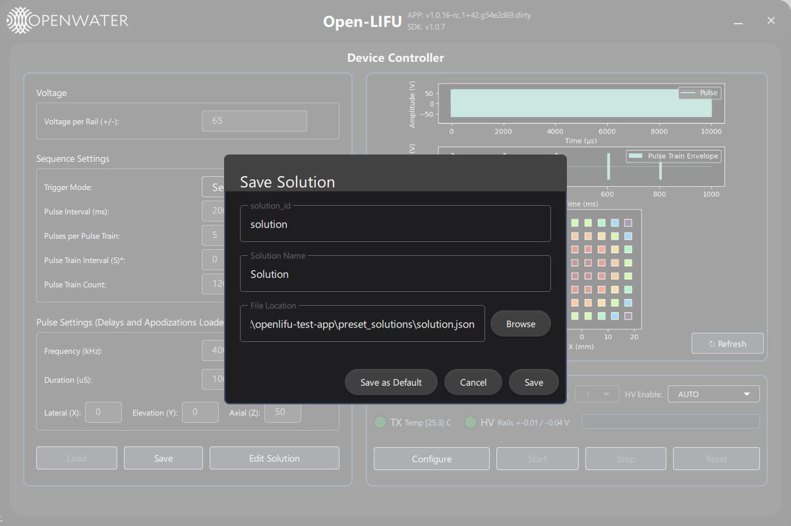

# Controller Page — User Guide

**Open-LIFU Test App**

**Docs Navigation:** [README](../README.md) | [Launch Options](launch-options.md) | [Transmitter](transmitter-page-user-guide.md) | [Console](console-page-user-guide.md) | [Verification](testing-page-user-guide.md) | [Settings](settings-page-user-guide.md) | [Support](support-page-user-guide.md)

## In This Page

- [Overview](#overview)
- [Inputs Panel](#panel-inputs)
- [Plot Panel](#panel-plot)
- [Status and Actions Panel](#panel-status-and-actions)
- [Typical workflow](#typical-workflow)

---

## Overview 

**[Back to top](#in-this-page)**

The **Controller** page is the main engineering surface for configuring and running an arbitrary sonication. It exposes every parameter the firmware accepts, lets you load and save full solutions to JSON, and drives the device through its `READY → RUNNING → READY` cycle.

The Controller has limited solution generation capabilities via it's input fields,
but does not have the full flexibility of the OpenLIFU application. For more complex sonication patterns, users should generate a JSON solution using the SDK and load it into the Controller. Solutions loaded from JSON disable the input fields, and respect the parameters as authoritative — the Controller becomes a live dashboard for monitoring and running the solution, but not editing it.

Navigate to the Controller page by clicking the controller icon in the
left sidebar.

---

## Inputs Panel

**[Back to top](#in-this-page)**

### Voltage

| Field | Units | Notes |
|-------|-------|-------|
| Voltage per Rail (+/-) | V | Peak-to-peak is double this value |

### Sequence Settings

| Field | Units | Notes |
|-------|-------|-------|
| Trigger Mode | — | `Single` (one train), `Continuous` (repeated indefinitely), `Sequence` (fixed count) |
| Pulse Interval | ms | Time between pulse starts |
| Pulse Count | — | Pulses per train (disabled in Single mode) |
| Pulse Train Interval | s | Time between train starts (disabled in Single mode) |
| Pulse Train Count | — | Number of trains (Sequence mode only) |

When using Trigger Mode "Single", the Pulse Train Interval and Pulse Train Count fields are disabled, and the device will emit a single train of pulses when Start is pressed. In "Continuous" mode, the device will emit trains of pulses indefinitely until Stop is pressed; the Pulse Train Interval field is enabled but ignored, and the Pulse Train Count field is disabled. In "Sequence" mode, the device will emit a fixed number of pulse trains as specified by the Pulse Train Count field; both the Pulse Train Interval and Pulse Train Count fields are enabled.

### Pulse Settings

| Field | Units | Notes |
|-------|-------|-------|
| Frequency | kHz | Stored/sent as Hz internally |
| Duration | µs | Pulse-on time within each pulse |

### Focus Point

| Field | Units | Notes |
|-------|-------|-------|
| X / Y | mm | Lateral offset, typically 0 / 0 |
| Z | mm | Steering depth from the transducer face |

### Field colour conventions

- **White** — pristine value, never sent
- **Green** — value confirmed by the device after a successful Configure
- **Grey** — section is read-only (a solution was loaded from a JSON
  file, or the device is currently running)
- **Orange** — value is being directly edited but not yet committed to the device

Once the device has been configured at least once on a manually-entered
solution, edits to individual fields are committed straight to the device
when you press Enter or tab away — no need to re-Configure for each
change.

### Solution Load/Save controls
At the bottom of the left column are controls for loading and saving sonication
solutions as JSON files. This is the only way to interact with the more complex
parameters like arbitrary delays and element apodizations.

Selecting **Load** will pull up the Load Solution Dialog:

| Control | Action |
|---------|--------|
| **Preset** dropdown | Pick a JSON solution from the presets solution folder |
| **Load from File** | Open a file picker for an arbitrary `.json` solution |
| **Cancel** | Close the dialog without loading a solution |
| **Load** | Load the selected solution, close the dialog |

Loading a solution from disk locks the input fields (read-only grey)
because the JSON is treated as authoritative.

Selecting **Save** will open the Save Solution Dialog:

| Control | Action |
|---------|--------|
| **Solution_id** | Identifer for the solution, used as the filename when saving |
| **Solution Name** | Human-friendly name for the solution, stored in the JSON metadata |
| **File Location** | Directory to save the JSON solution to |
| **Browse** | Open a directory picker to select the File Location |
| **Save as Default** | Save the solution as the default parameters to use when the app is opened |
| **Cancel** | Close the dialog without saving |
| **Save** | Save the solution to file and close the dialog |

Clicking **Edit Solution** after loading a solution from JSON will drop the loaded solution, unlock the fields, and allow you to edit parameters manually. This is a one-way operation — once you click Edit Solution, the Controller will no longer reference the loaded JSON for any parameters, and any changes you make in the UI will not be reflected in the JSON. If you want to go back to the loaded JSON parameters, you can either re-load the solution from file or click Reset to drop all parameters and return to the default state.

---

## Plot Panel

**[Back to top](#in-this-page)**

The plot shows the pulse to be generated, the envelope of the pulse train, and a representation of the time delays applied to each element. The depiction of the time delays uses a fixed approximation of the element position based on whether or not there are 1 or 2 modules connected. 

---

## Status and Actions Panel

**[Back to top](#in-this-page)**

### Connection / status header

| Indicator | Meaning |
|-----------|---------|
| **System State** | Mirrors `LIFUConnector.state`: Disconnected / Connected / Ready / Running |
| **Modules** | Number of connected TX modules |
| **HV Mode** | AUTO / ON / OFF / WHILE_RUNNING |
| **TX LED** | Red = disconnected · Dark green = connected · Green = ready · Blue = running |
| **Temp [...]** | Per-module TX driver temperature in °C |
| **HV LED** | Red = disconnected · Dark green = connected · Green = ready · Blue = HV rail energised |
| **Rails +x.xx / -x.xx V** | Most recent monitored HV rail readings |
| **Progress Bar** | See below |

### Action buttons

| Button | Behaviour |
|--------|-----------|
| **Configure** | Validate the current parameters and push them to the firmware. Required at least once before Start can be enabled. |
| **Reset** | Drop the loaded solution, unlock fields, drop HV (if `AUTO`), and return to `CONNECTED` |
| **Start** | Begin sonication. Disabled until the device is in `READY` |
| **Stop** | Abort the current run |

### HV enable mode

| Mode | Behaviour |
|------|-----------|
| **AUTO** *(default)* | HV held on whenever the TX has a valid solution loaded |
| **ON** | HV held on continuously |
| **OFF** | HV held off; Start is blocked |
| **WHILE_RUNNING** | HV energised only while sonication is actually running |

### Sonication progress

A progress bar at the bottom of the right column tracks the current run.

| State | Colour | Text |
|-------|--------|------|
| Idle | Grey | *(empty)* |
| Running | Blue | `RUNNING i/N` (Sequence) or `RUNNING i` (Continuous) |
| Finished | Green | `FINISHED N/N` |
| Stopped | Orange | `STOPPED` |

Progress updates are driven by unsolicited `STATUS` frames from the
firmware, so the bar advances even when the app is not actively polling.

---

## Typical workflow

**[Back to top](#in-this-page)**

1. Connect the Console and Transmitter — the **TX** and **HV** LEDs go
   green.
2. Either pick a preset, load a solution from disk, or fill in the
   parameter fields manually.
3. Click **Configure**. Fields turn green; the plot refreshes; the
   System State moves to `Ready`.
4. Click **Start**. The progress bar begins to fill and the system state
   flips to `Running`.
5. Wait for **FINISHED** (if using Single or Sequence mode), or click **Stop** to abort.
6. Edit any field and press Enter — the new value is pushed live without
   a full re-Configure (assuming you have not loaded a solution from
   file).

---

**Previous:** [Launch Options](launch-options.md)  
**Next:** [Transmitter Page - User Guide](transmitter-page-user-guide.md)
