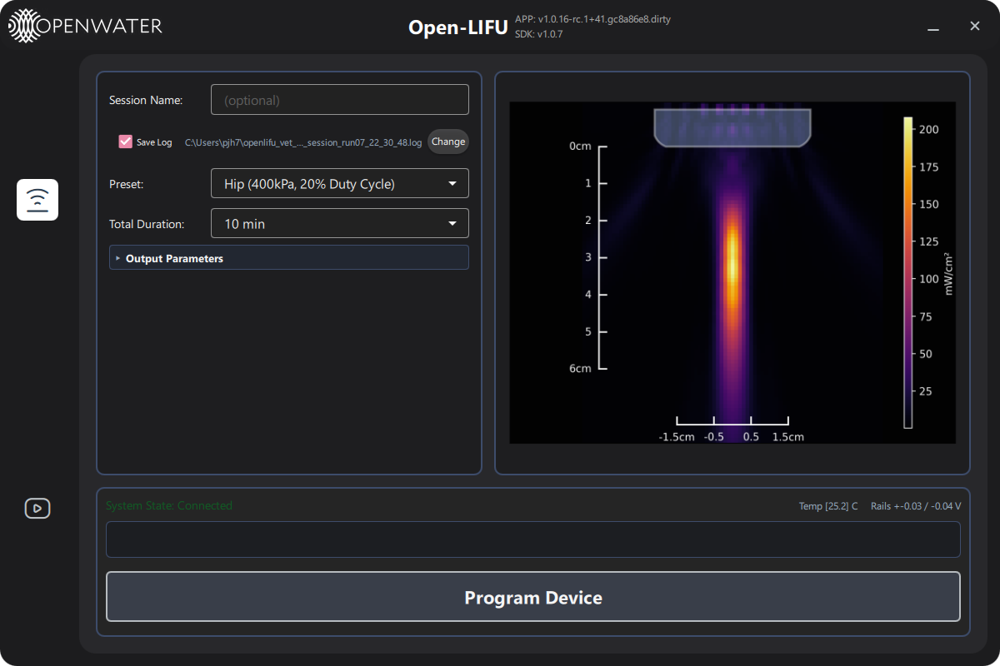
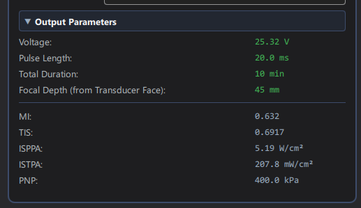
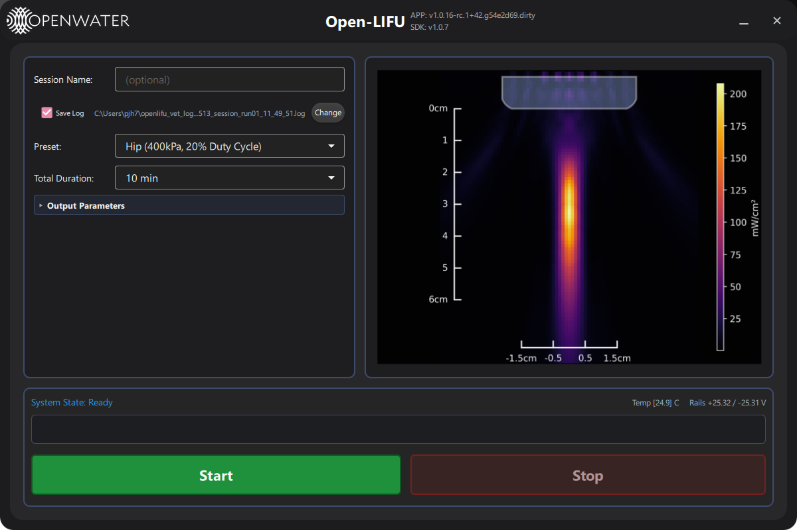
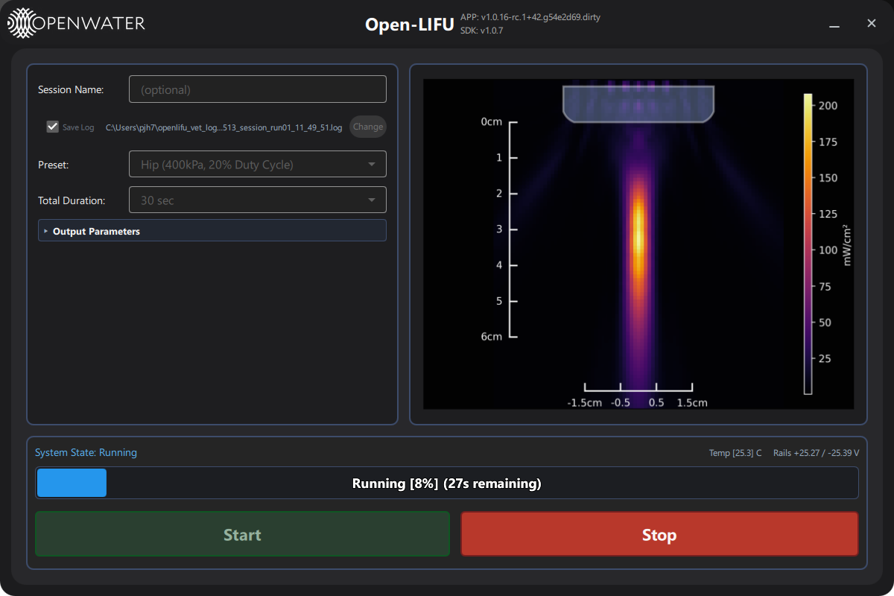
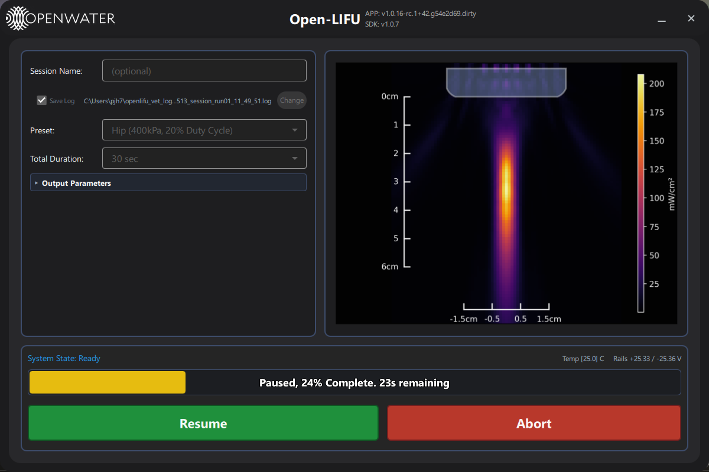
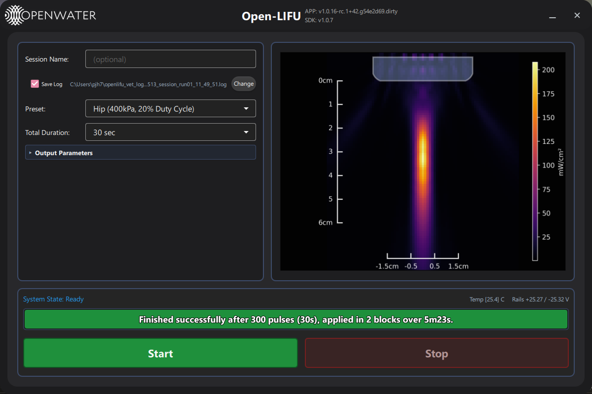
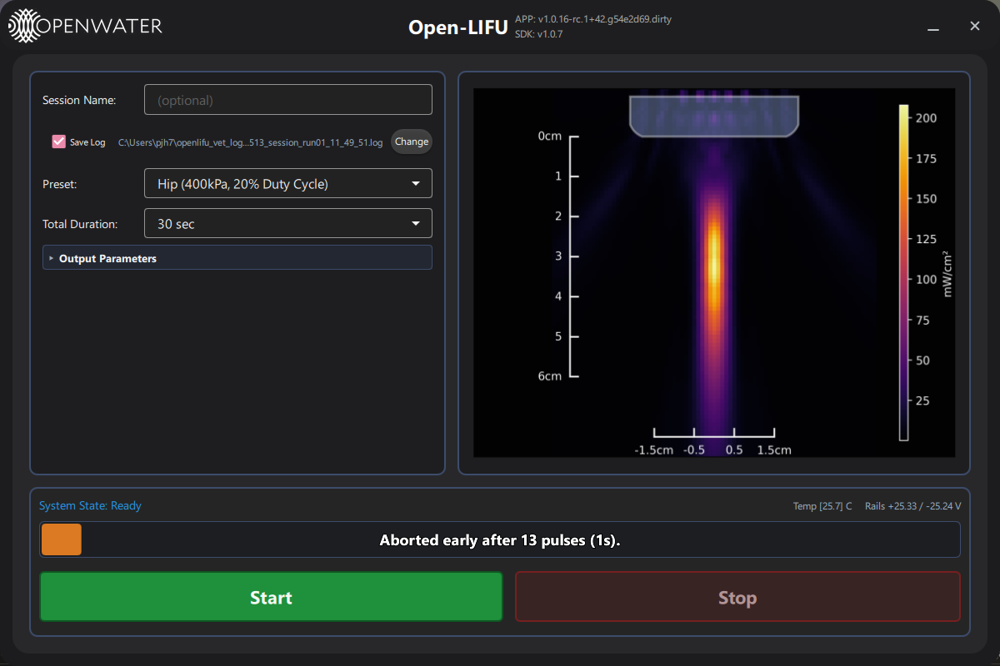

# OpenLIFU Operator Interface
---

## Overview

The **Operator** page is a single-screen kiosk UI for bedside operators. It is the default landing page whenever the app is launched with a ``--context=<name>`` argument (e.g. ``--context=vet`` or ``--context=diathermy``).
It hides every parameter that should not be touched at the bedside and
exposes only:

- a small set of **preset protocols** (hip / knee / spine, all 400 kPa),
- a **total duration** picker,
- session bookkeeping (operator-defined session name, log save toggle
  and folder),
- start / stop / pause controls,
- live progress, temperature, and HV-rail telemetry.

The Operator page is the *only* page shown when the app is launched with
a ``--context=<name>`` flag. In that mode the sidebar is hidden and the
page fills the entire window. See [launch-options.md](launch-options.md) for the full launch matrix.

The set of preset protocols and the duration choices come from
`preset_settings/<context>/` (settings JSONs + intensity plot PNGs +
`constants.json`). The veterinary configuration described below uses
`--context=vet` and ships three 400 kPa presets (hip / knee / spine);
adding a new context is simply a matter of dropping a new folder under
`preset_settings/` and launching with `--context=<new-folder-name>`.

---

## Session controls
For better organization of run logs, the Operator page has a few session management features:

| Field | Behaviour |
|-------|-----------|
| **Session Name (Optional)** | Descriptive name of the session |
| **Save Log** | Checkbox to enable or disable automatic log saving |
| **Log path** | Destination path for logs |
| **Change** | Choose a new log destination |

The log file captures information about reach run with elapsed-time stamps, plus any unhandled exceptions raised during the run. An incrementing `run_{NN}` suffix is automatically appended to the session name to avoid overwriting logs from previous runs with the same session name. The log file name format is: `YYYYMMDD_{session_id}_run_{NN}_hh_mm_ss.log`. The session id is a sanitized version of the Session Name field to avoid filesystem issues (e.g. spaces are replaced with underscores, and special characters are removed).

Clicking the **Log path** text opens the folder where logs are saved. If **Save Log** is enabled, the file name of the next run's log is shown in the Log path text. Hovering over the Log path text shows the full projected file path in a tooltip.

---

## Device Configuration

| Control | Source |
|---------|--------|
| **Preset** | Dropdown of available protocols |
| **Total Duration** | Total sonication duration selector |

Switching the preset reloads voltage, frequency, focal depth, and pulse parameters from the preset JSON. If the device is already configured the new values are pushed live without needing to re-press **Configure**. The plot area updates to the matching pre-rendered intensity PNG that ships with each preset.

The device reads calibration data for each module on connect, and applies per-device sensitivity scaling to the voltage to ensure the preset's calibration pressure is hit regardless of sensitivity variation. For example, if a particular module is less sensitive than the reference used to create the preset, the voltage for that module will be automatically increased to compensate.

### Output Parameters (collapsible)

Click the **▶ Output Parameters** header to expand a read-only summary
of the active preset:

- **Voltage** — final per-rail voltage after applying per-device
  sensitivity scaling (so a particular module always produces the
  preset's calibration pressure regardless of sensitivity variation).
- **Pulse Length**, **Total Duration**, **Focal Depth**.
- **MI**, **TIS**, **ISPPA**, **ISTPA**, **PNP** — acoustic analysis
  values from the preset's `analysis` block.

---

## Visualization Panel (top-right)
The plot area shows a pre-rendered visualization the intensity profile of the selected preset. A semitransparent overlay of the acoustic standoff pad is shown at the top, and
rulers are shown on the left and the bottom to show the focal profile dimensions relative
to the surface of the skin.

## Run Controls (bottom)

| Button | Behaviour |
|--------|-----------|
| **Configure** | Push the active preset + duration to the device. Required at least once before Start can be enabled. Disappears after pressed |
| **Start** | Begin sonication. The progress bar starts filling; system state goes to `Running` |
| **Stop** | Suspend a run partway. The bar stays at its current fraction and turns yellow |
| **Resume** | Continue from where Pause left off. Only available while paused|
| **Stop** | Abort the run. Only available while paused |

### Progress states

| State | Bar colour | Notes |
|-------|------------|-------|
| Idle | Grey | No run yet |
| Running | Blue | Shows percent + remaining time |
| Paused | Yellow | Cooling down or operator pause |
| Aborted | Orange | Stop pressed or thermal shutdown |
| Finished | Green | Run completed normally |

After Configuring, the system is in the 'Ready' state. The Duration and Preset can still be changed at this stage.

While running, a Blue progress bar fills to show how much of the sonication is complete and how much time is remaining.

If the user utilizes the 'Pause' feature and resumes the run, the system will continue from where it left off, and keep track of how many "blocks" of running have been used. At the completion of the sonication, the number of blocks will be shown, and recorded in the log.

If the user presses 'Abort' after pausing a run, the system will stop the run and return to the 'Ready' state. The progress bar will turn orange to indicate the run was stopped before completion.

### Thermal safety

Two thresholds in [lifu/lifu_connector.py](../lifu/lifu_connector.py)
gate the run engine:

- **Starting threshold** (50 °C by default) — If not running, the engine refuses to start a run if any module is above this temperature, and prompts the user to wait for cooling. Once the temperature drops below the threshold the user can start the run.
- **Shutdown threshold** (75 °C by default) — the engine aborts the
  run and pops a Thermal Shutdown dialog. The device will enter a cooldown state until all modules drop below the starting threshold, at which point the user can re-Configure and Start again.

---

## Typical workflow

1. Connect the Console and Transmitter.
2. Type a **Session Name** (e.g. patient or animal ID).
3. Pick a **Preset** and **Total Duration**.
4. Click **Configure** — system state goes to `Ready`.
5. Click **Start**. Watch the progress bar and temperatures.
6. When the run finishes, the log toast shows where the `.log` file was
   written.

---
