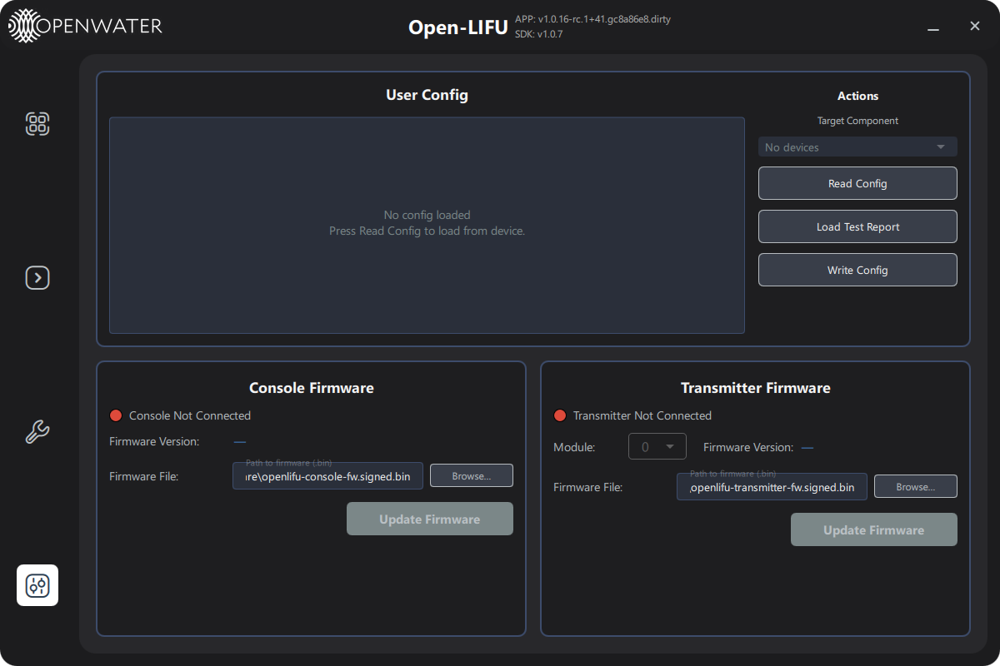

# Settings Page — User Guide

**Open-LIFU Test App**

**Docs Navigation:** [README](../README.md) | [Launch Options](launch-options.md) | [Controller](controller-page-user-guide.md) | [Transmitter](transmitter-page-user-guide.md) | [Console](console-page-user-guide.md) | [Verification](testing-page-user-guide.md) | [Support](support-page-user-guide.md)

<a id="in-this-page"></a>

## In This Page

- [Overview](#overview)
- [Page layout](#page-layout)
- [User Config card](#user-config-card)
- [Console Firmware card](#console-firmware-card)
- [Transmitter Firmware card](#transmitter-firmware-card)
- [Connection behaviour](#connection-behaviour)
- [Troubleshooting](#troubleshooting)

---

<a id="overview"></a>

## Overview

**[Back to top](#in-this-page)**

The **Settings** page covers two distinct engineering workflows:

1. **User Config** — read, edit, and write the per-device user
   configuration JSON for the connected Console or any of the connected
   TX modules. Also supports loading values from an Excel test report.
2. **Firmware Update** — flash a new signed `.bin` firmware image to
   either the Console or a selected TX module.

> **Warning:** Both workflows write directly to device persistent
> storage. A bad config or interrupted firmware update can require a
> bench recovery. Stop any sonication first; the app blocks navigation
> to Settings while `state == RUNNING`.

Navigate to the Settings page by clicking the gear icon in the left
sidebar. The page is hidden in `--simulate` mode.



---

<a id="page-layout"></a>

## Page layout

**[Back to top](#in-this-page)**

| Region | Purpose |
|--------|---------|
| **Top — User Config card** | JSON editor + per-target action buttons |
| **Bottom-left — Console Firmware card** | Update the HV controller's firmware |
| **Bottom-right — Transmitter Firmware card** | Update an individual TX module's firmware |

While the page first queries connected TX modules, a busy spinner is
shown over the Transmitter Firmware card with the label *"Querying
transmitter modules…"*.

---

<a id="user-config-card"></a>

## User Config card

**[Back to top](#in-this-page)**

### Target component

The **Target Component** dropdown lists every device whose user config
can currently be edited. Today this is `TX 0`, `TX 1`, … one entry per
detected TX module. (Console user config is supported by the SDK but
gated off in the UI until firmware support lands — the relevant code is
present and commented in [pages/Settings.qml](../pages/Settings.qml).)

### Selected device info

When a TX module is selected, two read-only rows below the dropdown
show the chosen module's **Device ID** and **Firmware Version**.

### JSON editor

A monospaced text area shows the user config JSON. It is empty by
default; click **Read Config** to populate it.

### Actions

| Button | Behaviour |
|--------|-----------|
| **Read Config** | Read the user config from the selected target into the editor |
| **Load Test Report** | Open a file picker for an Excel test report (`.xlsx`/`.xls`). The matching configuration values are converted via [`test_reports/test_reports.py`](../test_reports/test_reports.py) and pasted into the editor. The report's device serial is checked against the selected target |
| **Write Config** | Validate the editor contents as JSON and push them to the selected target's persistent storage |

A status line above the editor flashes green on success or red on
failure for ~4 seconds, then hides itself.

### JSON shape

The user config is a JSON object the SDK reads on boot. A typical
example (TX module):

```json
{
  "sn": "EVT2A-400K-02",
  "hwid": "ZNNytAKZ",
  "freq": 400,
  "hw_ver": "EVT2A",
  "fw_ver": "2.0.5",
  "sdk_ver": "1.0.7",
  "module": {
    "id": "txm_400_evt2a-400k-02",
    "name": "TXM 400kHz (S/N EVT2A-400K-02)",
    "nx": 8,
    "ny": 8,
    "pitch": 5,
    "frequency": 400000.0,
    "kerf": 0.3,
    "crosstalk_frac": 0.12,
    "crosstalk_dist": 0.00505,
    "sensitivity": [[400000, 2720], [410000, 2267], ...]
  }
}
```

Sensitivity calibration values written here are what the Operator page uses
to scale per-preset voltage so each module produces the preset's
calibration pressure.

---

<a id="console-firmware-card"></a>

## Console Firmware card

**[Back to top](#in-this-page)**

| Element | Behaviour |
|---------|-----------|
| **Status indicator** | Green = HV controller connected, Red = not connected |
| **Firmware Version** | The version currently reported by the connected Console |
| **Firmware File** | Path to the signed `.bin` image to flash. Pre-populated with the bundled default; click **Browse…** to override |
| **Update Firmware** | Push the file at the configured path. Disabled until the path is non-empty and the Console is connected |

Clicking **Update Firmware** opens a modal progress dialog showing the
written bytes and a percentage. The dialog locks the page until the
flash finishes (or fails) and you click **Close**.

---

<a id="transmitter-firmware-card"></a>

## Transmitter Firmware card

**[Back to top](#in-this-page)**

| Element | Behaviour |
|---------|-----------|
| **Status indicator** | Green = TX connected. Shows the connected module count |
| **Module** dropdown | Pick which TX module to flash. The **Firmware Version** field updates to that module's reported version when you switch |
| **Firmware File** | Path to the signed `.bin` image. Pre-populated; **Browse…** to override |
| **Update Firmware** | Flash the chosen module. Disabled until a module is selected, the path is non-empty, and the TX is connected |

The same modal progress dialog used for the Console flash is reused
here.

---

<a id="connection-behaviour"></a>

## Connection behaviour

**[Back to top](#in-this-page)**

- On HV connect, the page waits ~500 ms then queries the Console
  firmware version.
- On TX connect, the page waits ~1.5 s then queries the module count
  and the firmware version of the currently-selected module.
- On disconnect of either device, the corresponding firmware version
  fields reset to `—` and the User Config target dropdown rebuilds.
- The page blocks navigation away to / from Settings while sonication
  is running (`state == RUNNING`). Switching from a sonication page to
  Settings while configured forces a Reset and drops HV.

---

<a id="troubleshooting"></a>

## Troubleshooting

**[Back to top](#in-this-page)**

| Symptom | Likely cause | Action |
|---------|--------------|--------|
| User Config dropdown shows "No devices" | TX not connected | Plug in the TX; the dropdown rebuilds automatically |
| **Write Config** flashes red | JSON is malformed, or the device rejected the payload | Re-read, fix, and try again. Check the application log for the firmware error |
| **Load Test Report** flashes red with a serial mismatch | The selected report does not belong to the selected device | Pick the correct report (or switch the **Target Component** dropdown) |
| **Update Firmware** is greyed out | Path empty, or device not connected, or another update in progress | Check all three preconditions |
| Update dialog shows an error mid-flash | USB drop, cable issue, or wrong firmware image | Power-cycle the device. Use a known-good signed `.bin`. Do not interrupt the next attempt |
| Cannot navigate to Settings | A sonication is currently running | Stop the run from the [Controller](controller-page-user-guide.md) or Operator Interface app first |

---

**Previous:** [Verification Page - User Guide](testing-page-user-guide.md)  
**Next:** [Support Page - User Guide](support-page-user-guide.md)
