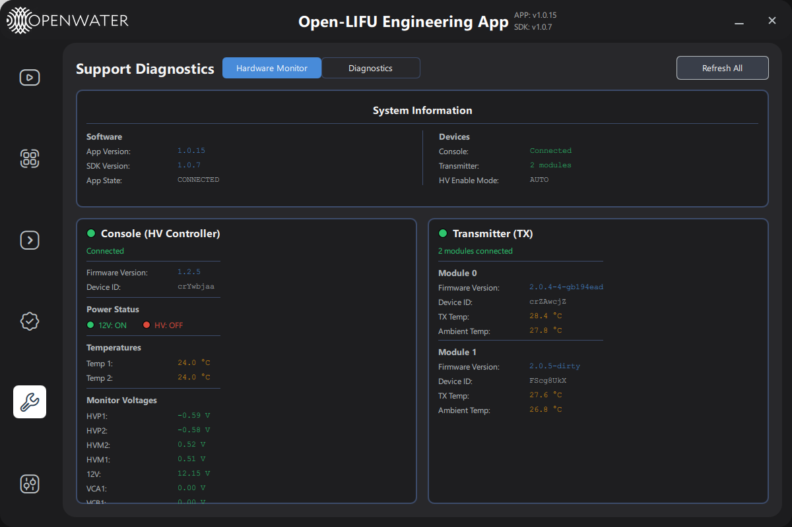
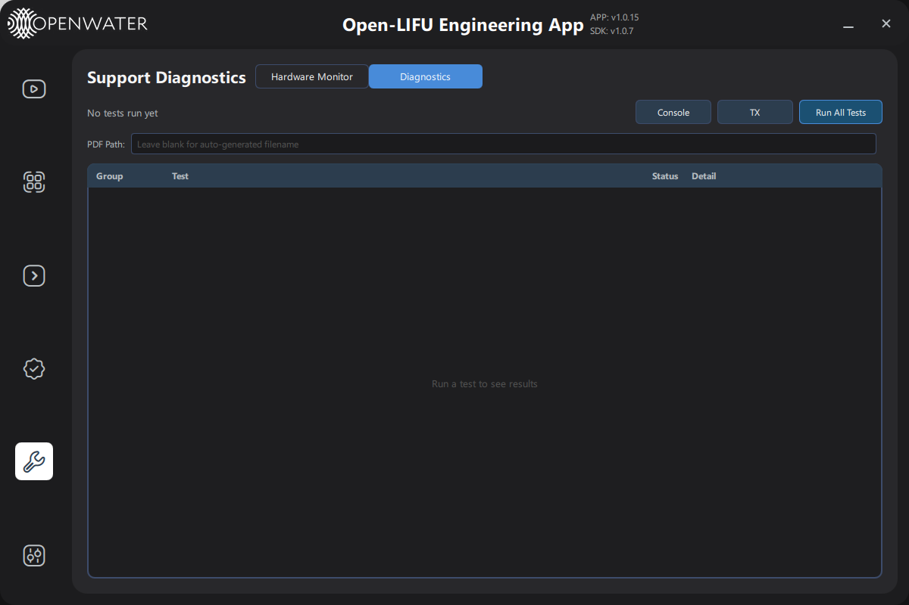
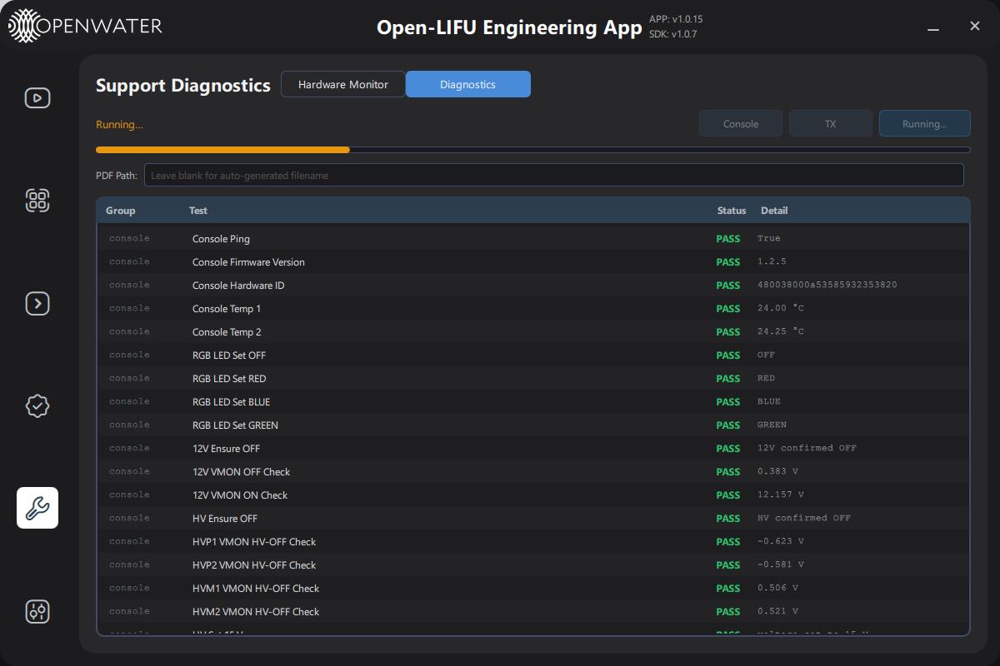
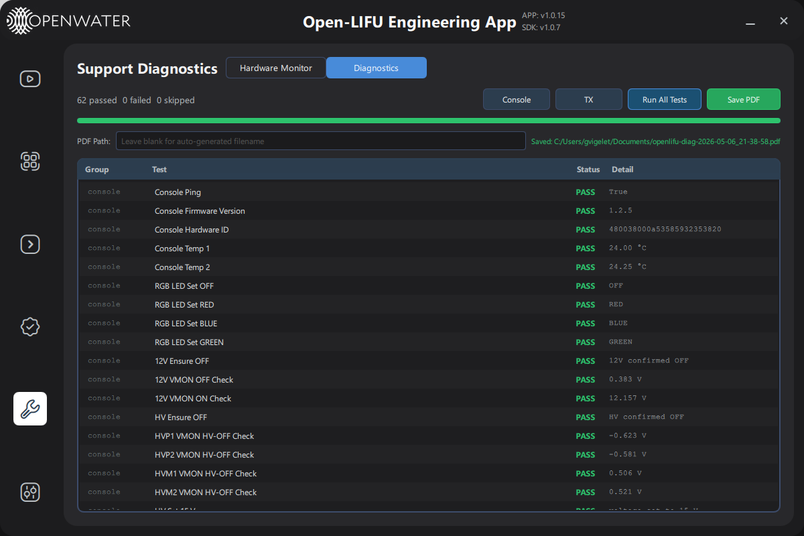

# Support Page — User Guide

**Open-LIFU Test App · App v1.0.15 · SDK v1.0.7**

**Docs Navigation:** [README](../README.md) | [Launch Options](launch-options.md) | [Controller](controller-page-user-guide.md) | [Transmitter](transmitter-page-user-guide.md) | [Console](console-page-user-guide.md) | [Verification](testing-page-user-guide.md) | [Settings](settings-page-user-guide.md)

<a id="in-this-page"></a>

## In This Page

- [Overview](#overview)
- [Hardware Monitor Tab](#hardware-monitor-tab)
- [Diagnostics Tab](#diagnostics-tab)
- [Connection Behaviour](#connection-behaviour)
- [Troubleshooting](#troubleshooting)

---

<a id="overview"></a>

## Overview

**[Back to top](#in-this-page)**

The **Support Diagnostics** page provides real-time hardware monitoring and an automated diagnostic test suite for the Open-LIFU system. It is split into two tabs:

| Tab | Purpose |
|-----|---------|
| **Hardware Monitor** | Live snapshot of firmware versions, temperatures, power status, and monitor voltages for all connected devices |
| **Diagnostics** | Run automated tests against the Console and/or Transmitter and export the results as a PDF report |

Navigate to the Support page by clicking the wrench icon in the left sidebar.

---

<a id="hardware-monitor-tab"></a>

## Hardware Monitor Tab

**[Back to top](#in-this-page)**



### System Information Card

The System Information card at the top of the page shows a snapshot of the current software and device state.

**Software section**

| Field | Description |
|-------|-------------|
| App Version | Installed version of the Open-LIFU Test App |
| SDK Version | Version of the underlying OpenLIFU SDK |
| App State | Current state machine state: `DISCONNECTED`, `CONNECTED`, `READY`, `RUNNING`, or `TEST_SCRIPT_READY` |

**Devices section**

| Field | Description |
|-------|-------------|
| Console | Connection status of the HV Controller (Console) |
| Transmitter | Number of TX modules detected, or "Not Connected" |
| HV Enable Mode | Active high-voltage enable policy: `AUTO`, `ON`, or `OFF` |

### Console (HV Controller) Card

The left card shows information for the connected Console board.

- **Firmware Version** — Reported by the device over USB.
- **Device ID** — Unique hardware identifier.
- **Power Status** — Green/red badges indicate whether the 12 V rail and the high-voltage rail are currently active.
- **Temperatures** — Two on-board temperature sensor readings in °C, updated automatically on connect and on each Refresh.
- **Monitor Voltages** — Eight analogue voltage monitor channels read from the Console:

| Channel | Description |
|---------|-------------|
| HVP1 | High-voltage positive rail 1 |
| HVP2 | High-voltage positive rail 2 |
| HVM2 | High-voltage negative rail 2 |
| HVM1 | High-voltage negative rail 1 |
| 12V | 12 V system rail |
| VCA1 | Control voltage A1 |
| VCB1 | Control voltage B1 |
| VCC1 | Control voltage C1 |

### Transmitter (TX) Card

The right card lists each detected TX module with its own sub-section showing:

- **Firmware Version**
- **Device ID**
- **TX Temp** — Driver-side temperature in °C
- **Ambient Temp** — Board ambient temperature in °C

If no modules are detected the card shows *"No modules detected"*.

### Refresh All

Click **Refresh All** (top-right of the Hardware Monitor tab) to re-query all connected devices immediately. The button is disabled while a refresh is in progress and when no Console is connected. A *Refreshing…* label appears while waiting for responses.

> **Note:** Data is also refreshed automatically approximately 2–3 seconds after a device connects, so you rarely need to trigger a manual refresh.

---

<a id="diagnostics-tab"></a>

## Diagnostics Tab

**[Back to top](#in-this-page)**

The Diagnostics tab runs a structured test suite against connected hardware and provides a pass/fail report that can be exported as a PDF.

### Initial State



When no tests have been run the results table shows *"Run a test to see results"*. The run-control buttons are enabled only for devices that are currently connected.

### Running Tests



| Control | Description |
|---------|-------------|
| **Console** button | Runs the Console (HV Controller) test group only |
| **TX** button | Runs the Transmitter test group only |
| **Run All Tests** button | Runs both Console and TX groups sequentially |

While tests are executing:

- A status label shows *"Running…"* in orange.
- The **progress bar** fills from left to right as each individual test step completes.
- Results stream into the table in real time — you do not need to wait for the run to finish to start reading results.
- All run-control buttons are disabled until the run finishes.

> **Note:** Background hardware monitoring (temperature polling, etc.) is automatically paused while the Diagnostics tab is active to prevent test interference. Monitoring resumes when you switch back to the Hardware Monitor tab.

### Results Table

Each row in the results table represents a single test step.

| Column | Description |
|--------|-------------|
| **Group** | Test group: `console` or `tx` |
| **Test** | Human-readable test name |
| **Status** | `PASS` (green), `FAIL` (red), or `SKIP` (orange) |
| **Detail** | A short value or message, e.g. a measured voltage or an error reason |

Hover over a truncated **Detail** cell to see the full text in a tooltip.

#### Console Test Group

The console group covers:

- Connectivity ping
- Firmware version check
- Hardware ID readback
- Dual temperature sensor readings
- RGB LED colour cycling (OFF → RED → BLUE → GREEN)
- 12 V power rail on/off verification
- 12 V voltage monitor measurement
- High-voltage rail enable/disable verification
- HV monitor channel readings (HVP1, HVP2, HVM1, HVM2)
- HV voltage ramp and trim checks
- User configuration read/write round-trip

#### TX Test Group

The TX group covers each detected module:

- Module connectivity ping
- TX chip enumeration
- Firmware version readback
- Device ID readback
- TX and ambient temperature readings
- Per-chip register read/write verification

### Summary Line

After the run completes the status line at the top-left shows a count of passed, failed, and skipped tests, e.g.:

```
62 passed  0 failed  0 skipped
```

The count is shown in red if any tests failed.

### Saving a PDF Report



The **Save PDF** button appears after at least one test run has completed.

1. **Optional** — Enter a custom file path in the **PDF Path** field. Leave it blank to use an auto-generated filename in your Documents folder (e.g. `openlifu-diag-2026-05-06_21-38-58.pdf`).
2. Click **Save PDF**.
3. A confirmation message appears in green to the right of the path field, showing the full saved path. An error message appears in red if the save fails.

The confirmation message disappears automatically after 5 seconds.

For reference, see an [example diagnostic report](openlifu-diag-2026-05-06_21-38-58.pdf) generated from a passing test run.

---

<a id="connection-behaviour"></a>

## Connection Behaviour

**[Back to top](#in-this-page)**

The Support page responds automatically to device connect and disconnect events:

- When the **Console connects**, firmware info, temperatures, and monitor voltages are queried after a 2-second debounce.
- When the **Transmitter connects**, firmware info and temperatures are queried after a 3-second debounce.
- When either device **disconnects**, all associated fields reset to `—` and status badges update immediately.

---

<a id="troubleshooting"></a>

## Troubleshooting

**[Back to top](#in-this-page)**

| Symptom | Likely cause | Action |
|---------|-------------|--------|
| All fields show `—` | Device not connected | Check USB cables; the status badge at the top of each card turns green when connected |
| Refresh All is greyed out | Console not connected | The button requires an active Console connection |
| Test buttons are greyed out | Corresponding device not connected | Connect the Console or Transmitter before running tests |
| `SKIP` result for a test | Device disconnected mid-run | Reconnect and run again |
| `FAIL` on a voltage monitor test | Rail out of expected range | Check power supply and cabling; contact support with the saved PDF report |
| PDF save error | Invalid path or permissions | Leave the PDF Path field blank to use the default Documents folder |

---

**Previous:** [Settings Page - User Guide](settings-page-user-guide.md)  
**Back to start:** [Launch Options](launch-options.md)
