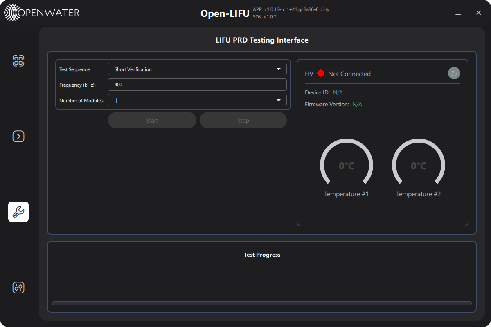

# Verification (Testing) Page — User Guide

**Open-LIFU Test App**

**Docs Navigation:** [README](../README.md) | [Launch Options](launch-options.md) | [Controller](controller-page-user-guide.md) | [Transmitter](transmitter-page-user-guide.md) | [Console](console-page-user-guide.md) | [Settings](settings-page-user-guide.md) | [Support](support-page-user-guide.md)

## In This Page

- [Overview](#overview)
- [Page layout](#page-layout)
- [Test sequences](#test-sequences)
- [Right column - Device info and temperatures](#right-column-device-info-and-temperatures)
- [Test Progress section](#test-progress-section)
- [Typical workflow](#typical-workflow)
- [Troubleshooting](#troubleshooting)

---

## Overview

**[Back to top](#in-this-page)**

The **Verification** page (labelled *"Verification"* in the sidebar,
backed by `pages/Testing.qml`) hosts the long-running, automated PRD
(Product Requirements Document) verification scripts that ship with
[`openlifu_verification`](https://github.com/OpenwaterHealth). These
tests drive the device under real load to characterise thermal, voltage,
and uptime behaviour, and produce per-run log files suitable for
regulatory evidence.

> **Note:** The Verification page is for **engineering / QA use only**.
> Routine "is this thing working?" checks should use the
> [Support](support-page-user-guide.md) page's Diagnostics tab instead.
> Diagnostics is fast (~1 minute), runs on demand, and produces a PDF
> report. Verification tests can run for many minutes and are gated on
> a connected Console + Transmitter.

Navigate to the Verification page by clicking the verification icon in
the left sidebar. The page is hidden in `--simulate` mode.

---

## Page layout

**[Back to top](#in-this-page)**

| Region | Purpose |
|--------|---------|
| **Top-left** | Test sequence selector + shared frequency / module-count settings + Start / Stop |
| **Top-right** | HV connection status, Device ID, firmware version, two temperature widgets |
| **Bottom** | Test progress section: per-case progress bar, optional overall progress bar, log file path |

---

## Test sequences

**[Back to top](#in-this-page)**

Pick one of the four scripts from the **Test Sequence** dropdown:

| Sequence | Source | Purpose |
|----------|--------|---------|
| **Short Verification** | `prodreqs_tx_short_verification_test` | Quick functional sweep of TX outputs |
| **Long Verification** | `prodreqs_tx_long_verification_test` | Long-duration thermal + heating placeholder test. Has both a *case* and an *overall* progress bar |
| **Run Indefinitely** | `prodreqs_run_indefinitely_test` | Loops the TX continuously until **Stop** is pressed. Used for thermal soak |
| **Voltage Accuracy** | `prodreqs_voltage_accuracy_test` | Walks the HV setpoint through `TEST_VOLTAGES` and measures actual rail voltage. The Frequency / Number of Modules fields are disabled for this test |

### Shared settings

| Field | Notes |
|-------|-------|
| **Frequency (kHz)** | Drive frequency for the TX scripts. Range 100–500 kHz. Disabled for Voltage Accuracy |
| **Number of Modules** | `1` or `2`. Must match what is actually connected. Disabled for Voltage Accuracy |

### Start / Stop

- **Start** is enabled when the system is in `Connected`, `Ready`, or
  `Test Script Ready` state and not currently running.
- **Stop** is enabled only while a script is running (`state == 3`).
  Stop sends a graceful abort to the active script.

The four sequences have independent progress state, so switching the
dropdown after a run completes preserves the previous run's labels and
log path until you start a new run.

---

## Right column — Device info & temperatures

**[Back to top](#in-this-page)**

| Field | Description |
|-------|-------------|
| **HV** indicator | Green = connected, Red = not connected |
| **Device ID** | HV controller hardware ID |
| **Firmware Version** | HV controller firmware version |
| **Temperature #1 / #2** | Live HV controller temperature readings, °C |

Click the **↻** button to re-query device info and temperatures
manually.

---

## Test Progress section

**[Back to top](#in-this-page)**

The bottom panel updates live as a script runs.

| Element | Description |
|---------|-------------|
| **Status line** | Current case description (e.g. *"Case 3/8: Voltage 30 V…"*) |
| **Log path** | Full path of the log file the script is writing — appears as soon as the script opens it |
| **Case progress bar** | Fraction of the *current case* complete; coloured by status |
| **Overall progress label / bar** | Only shown for **Long Verification** and **Voltage Accuracy** — fraction of the *whole sequence* complete |

Status colour coding (case bar):

| Colour | Meaning |
|--------|---------|
| Grey | Idle / waiting |
| Blue | Running |
| Green | Pass / completed |
| Orange | Warning / partial |
| Red | Fail / aborted |

---

## Typical workflow

**[Back to top](#in-this-page)**

1. Connect the Console and Transmitter; confirm the right-column LED is
   green.
2. Choose a **Test Sequence**.
3. Set **Frequency** and **Number of Modules** (where applicable).
4. Click **Start**. The progress bar starts updating; the log file path
   appears underneath the status line.
5. Wait for completion, or click **Stop** to abort.
6. Open the log file at the displayed path for the full run record.

---

## Troubleshooting

**[Back to top](#in-this-page)**

| Symptom | Likely cause | Action |
|---------|--------------|--------|
| Start is greyed out | Device not connected, or sonication already running | Check the HV LED; if a sonication is in progress on Controller / Operator, stop it first |
| Frequency / Number of Modules disabled | Voltage Accuracy is selected | These two fields don't apply to Voltage Accuracy |
| Stop appears to do nothing | Script is between two long-running steps | Allow a few seconds for the abort to be honoured |
| Progress bar stays at zero | Script hasn't reached its first checkpoint yet | Check the log file path; tail the file to see live output |
| Log file path is empty | Script crashed before opening its log | Check the application log (run with `--loglevel debug`) |

---

**Previous:** [Console Page - User Guide](console-page-user-guide.md)  
**Next:** [Settings Page - User Guide](settings-page-user-guide.md)
