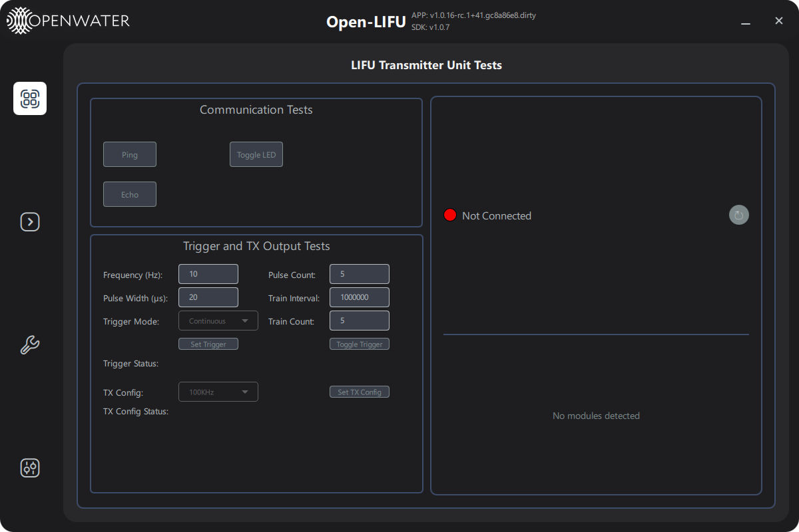

# Transmitter Page — User Guide

**Open-LIFU Test App**

**Docs Navigation:** [README](../README.md) | [Launch Options](launch-options.md) | [Controller](controller-page-user-guide.md) | [Console](console-page-user-guide.md) | [Verification](testing-page-user-guide.md) | [Settings](settings-page-user-guide.md) | [Support](support-page-user-guide.md)

## In This Page

- [Overview](#overview)
- [Page layout](#page-layout)
- [Module selector](#module-selector)
- [Communication Tests](#communication-tests)
- [Trigger and TX Output Tests](#trigger-and-tx-output-tests)
- [Right column - Device info and temperatures](#right-column-device-info-and-temperatures)
- [Connection behaviour](#connection-behaviour)
- [Troubleshooting](#troubleshooting)

---

## Overview

**[Back to top](#in-this-page)**

The **Transmitter** page is the engineering bring-up surface for the
TX device. It exposes per-module communication tests, a low-level
trigger configurator, and a quick-pick TX configuration helper for the
three supported drive frequencies (100 kHz, 200 kHz, 400 kHz).

> **Note:** The Transmitter page is for engineering bring-up. End-to-end
> sonication should use the [Controller](controller-page-user-guide.md)
> page (full solution interface) or the Operator Interface app
> (preset-driven kiosk):
> [openlifu-operator-interface](https://github.com/OpenwaterHealth/openlifu-operator-interface).
> Routine hardware health checks should use
> the [Support](support-page-user-guide.md) page's Diagnostics tab.

Navigate to the Transmitter page by clicking the transmitter icon in
the left sidebar. The page is hidden in `--simulate` mode.

---

## Page layout

**[Back to top](#in-this-page)**

| Region | Purpose |
|--------|---------|
| **Module tab bar** *(top)* | One tab per detected TX module — every command is dispatched to the currently-selected module |
| **Left — Communication Tests** | Ping, Echo, Toggle LED |
| **Left — Trigger and TX Output Tests** | Free-form trigger configuration + quick TX config buttons |
| **Right** | TX connection LED, per-module Device ID, Firmware Version, TX and ambient temperature widgets |

While the page is loading the module list a busy spinner appears with
the label *"Querying transmitter modules…"*.

---

## Module selector

**[Back to top](#in-this-page)**

If multiple TX modules are connected, the tab bar at the top of the
page lets you target each one individually. Every Ping / Echo / LED /
trigger / config command is dispatched to whichever module tab is
currently active. The right-side device info, firmware version, and
temperature widgets also follow the active tab.

---

## Communication Tests

**[Back to top](#in-this-page)**

| Control | Behaviour |
|---------|-----------|
| **Ping** | Send a `PING` command to the active module. Result text shows `Ping SUCCESS` / `Ping FAILED` |
| **Echo** | Round-trip a fixed payload and verify it comes back intact |
| **Toggle LED** | Toggle the on-board status LED of the active module |

All three controls are disabled until the TX device is connected.

---

## Trigger and TX Output Tests

**[Back to top](#in-this-page)**

This box lets you exercise the trigger generator directly without going
through the full solution layer.

### Trigger configuration

| Field | Units | Notes |
|-------|-------|-------|
| **Frequency (Hz)** | Hz | Trigger generator output frequency. Defaults to `10` |
| **Pulse Count** | — | Pulses per train. Defaults to `5` |
| **Pulse Width (µs)** | µs | Pulse-on time within each pulse |
| **Train Interval** | µs | Time between train starts |
| **Trigger Mode** | — | `Sequence`, `Continuous` (default), or `Single` |
| **Train Count** | — | Number of trains (used in Sequence mode) |

| Button | Behaviour |
|--------|-----------|
| **Set Trigger** | Push the current six trigger fields to the firmware as a JSON command |
| **Toggle Trigger** | Start/stop the trigger generator with the most recently committed configuration |
| **Trigger Status** | Live read-back: `On` (green) / `Off` (red) |

> **Warning:** The Transmitter page bypasses the Controller's
> solution-based safety checks. The trigger generator drives the TX
> outputs directly with whatever you type here.

### TX configuration quick-pick

| Control | Behaviour |
|---------|-----------|
| **TX Config** dropdown | One of `100KHz`, `200KHz`, `400KHz` — picks a preset (frequency, pulse count, duration) |
| **Set TX Config** | Configure the TX with the selected preset, focused at `(0, 0, 25 mm)` and 12 V, in continuous trigger mode. Will stop the trigger first if it is currently running |
| **TX Config Status** | `Configured` (green) / `NOT Configured` (red) |

---

## Right column — Device info & temperatures

**[Back to top](#in-this-page)**

| Field | Description |
|-------|-------------|
| **TX** indicator | Green = connected, Red = not connected. Shows the total number of modules |
| **Device ID** | Per-module unique hardware identifier |
| **Firmware Version** | Per-module firmware version reported over USB |
| **TX Temp** | Live driver-side temperature, °C |
| **Ambient Temp** | Live board ambient temperature, °C |

Click the **↻** button to re-query device info, temperatures, and
trigger status manually. Otherwise the values are fetched once on
connect (after a ~1.5 s settle delay).

---

## Connection behaviour

**[Back to top](#in-this-page)**

- On TX connect, the page waits ~1.5 s then queries module count,
  device info, temperatures, and trigger status.
- On disconnect, every field resets and any cached module info is
  cleared.

---

## Troubleshooting

**[Back to top](#in-this-page)**

| Symptom | Likely cause | Action |
|---------|--------------|--------|
| All buttons greyed out | TX not connected | Plug in the Transmitter; check the LED at top-right turns green |
| Module tab bar shows fewer modules than expected | Slow enumeration, or module fault | Click the right-column **↻** to re-query the module count |
| `Ping FAILED` on one module only | That module is not responding | Power-cycle; check the cable to that module |
| Temperatures stuck at `0.0` | Page hasn't refreshed since connect | Click the **↻** in the right column |
| `Set TX Config` reports `NOT Configured` | Trigger was running and refused the new config | The button stops the trigger automatically before configuring; if it still fails check the firmware log |

---

**Previous:** [Controller Page - User Guide](controller-page-user-guide.md)  
**Next:** [Console Page - User Guide](console-page-user-guide.md)
